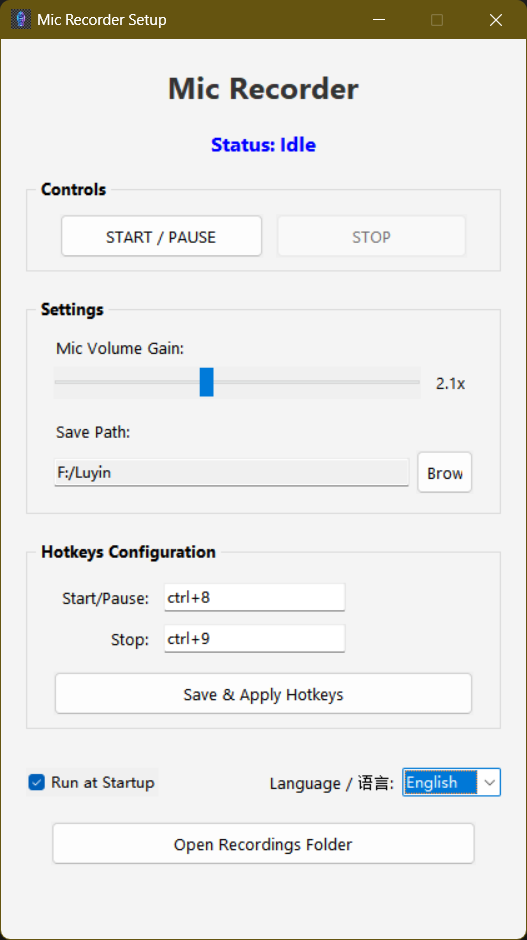

# 🎙️ Mic Recorder (Python)

[简体中文](README.md) | **English**

A ready-to-use local voice recorder for Windows, featuring global hotkeys, minimized system tray recording, and auto-start capabilities.



## ✨ Features

*   **🎧 High Quality Recording**: Lossless WAV recording powered by `PyAudio`.
*   **⌨️ Global Hotkeys**: Custom global hotkeys (Default: `Ctrl+1` Start/Pause, `Ctrl+2` Stop) work even when the app is in the background or while gaming.
    *   *Stability Optimized*: Uses async threads to prevent hotkey timeouts or unhooking.
*   **🛡️ Admin Rights**: Enforced Administrator privileges ensure hotkeys work on all surfaces, including Desktop and elevated apps.
*   **📥 System Tray Integration**: Minimizes to the system tray on close. Right-click menu supported.
*   **🚀 Silent Startup**: Supports "Run at Startup" and launches silently (minimized) to the tray without showing a window.
*   **🎨 Native UI**: Clean Tkinter interface that matches native Windows style. Supports English/Chinese switching.
*   **📂 Custom Save Path**: Browse and select any folder to save your recordings.
*   **⌨️ Smart Hotkey Binding**: Click the hotkey field and simply press your desired key combination (e.g., `Ctrl+Shift+A`) to bind it automatically.
*   **🔊 Real-time Feedback**: Toast notifications and tray icon changes provide instant status updates.

releases：(https://github.com/ixiaoxie/MicRecoder-Windows-/releases)

## 📖 User Guide

1.  **Launch**: Run `MicRecorder.exe` or `mic_recorder.py`.
2.  **Configure Hotkeys**: 
    *   Click inside the hotkey input fields in the "Settings" area.
    *   Press your desired key combination directly (e.g., `Ctrl` + `F1`). The app will auto-detect it.
    *   Click "Save & Apply Hotkeys" updates to take effect.
3.  **Start Recording**: 
    *   Press your "Start" hotkey (Default `Ctrl+1`) or click the "Start" button.
    *   The status will turn red ("Recording..."), and the tray icon will update.
4.  **Pause**: 
    *   Press the "Start" hotkey again or click "Pause". The status will show "Paused".
5.  **Stop & Save**: 
    *   Press the "Stop" hotkey (Default `Ctrl+2`) or click "Stop".
    *   The recording is automatically saved to your configured folder (Default: `Music\Recordings`).
6.  **View Files**: Click the "Open Recordings Folder" button at the bottom to access your WAV files.

## 🛠️ Technical Details

This project demonstrates how to build a complete Windows desktop application with Python.

### Architecture Overview

*   **GUI Framework**: Built with standard `Tkinter` and `ttk` theming, ensuring a native look without heavy dependencies.
*   **Core Recording**: `PyAudio` runs in a dedicated background daemon thread, ensuring the main UI remains responsive.
*   **System Interaction**:
    *   `ctypes` is used to create a named mutex for Single Instance Locking.
    *   `winreg` manipulates the Windows Registry for the "Run at Startup" feature.

### Key Techniques

1.  **Global Hotkeys & Anti-Blocking**:
    *   Uses the `keyboard` library for global hooks. To prevent I/O operations from blocking the hook thread (which causes Windows to remove the hook), hotkey callbacks are executed asynchronously (`run_async`).
    *   Hotkeys are bound 500ms after startup to ensure the message loop is fully ready.

2.  **UI State & Thread Safety**:
    *   The background recording thread notifies the UI of state changes via callbacks.
    *   Updates are scheduled back to the main thread using `root.after(0, func)` to prevent thread safety issues.

3.  **Resource Bundling**:
    *   A custom `resource_path` function handles path resolution for assets (icons) for both development and PyInstaller (`_MEIPASS`) environments.

4.  **Smart Hotkey Binding**:
    *   Listens to `focus` and `key` events on input fields. It analyzes the `event.state` bitmask to correctly identify modifier combinations like `Ctrl`, `Shift`, and `Alt`.

## 🛠️ Installation

### Requirements
*   Windows 10 / 11
*   Python 3.8+

### 1. Clone
```bash
git clone https://github.com/your-username/mic-recorder.git
cd mic-recorder
```

### 2. Install Dependencies
```bash
pip install -r requirements.txt
```
*Note: If running as a script, please ensure your terminal is running as Administrator.*

### 3. Run
```bash
python mic_recorder.py
```

## 📦 Build EXE

If you want to build a standalone EXE that runs without Python:

1.  Install PyInstaller: `pip install pyinstaller`
2.  Run build script: `build.bat`
3.  Find `MicRecorder.exe` in the `dist` folder.

## ⚠️ FAQ

**Q: Why does it ask for Administrator permission (UAC)?**
A: To ensure **Global Hotkeys** work reliably in all scenarios (like full-screen games or the Desktop), the application must have Administrator privileges.

**Q: Where is the window after startup?**
A: This is the **Silent Startup** feature. The app launches minimized to the System Tray (bottom right) to avoid disturbing you. Double-click the tray icon to show the window.

**Q: Antivirus false positive?**
A: Because the app uses global keyboard hooks and modifies the registry for startup, some sensitive antivirus software might flag it. Please whitelist it. This project is open source, and you are welcome to audit the code.

## 📜 License

[MIT License](LICENSE)
